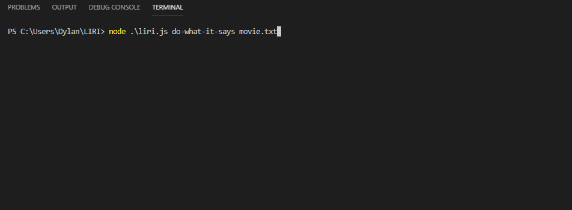

# LIRI
LIRI is a CLI (command line interface) written in Node that takes in command line arguments and allows the user to get data about songs, bands, or movies of their choice. It uses a number of Node packages in order to get and display API data.

## Challenges
This was my first Node project, so setting up the environment and installing the packages using `npm` was pretty new to me and required a bit of research. Because of all of the different packages and APIs used in this project, a lot of time was spent reading documentation. APIs calls as usual provided a challenge when it came to figuring out how to get the data I wanted and dealing with their unpredictability.

## Packages used: 
* [node-spotify-api](https://www.npmjs.com/package/node-spotify-api)
* [Axios](https://www.npmjs.com/package/axios)
* [Moment.js](https://www.npmjs.com/package/moment)
* [fs](https://nodejs.org/api/fs.html)
* [dotenv](https://www.npmjs.com/package/dotenv)

## APIs used:
* [Spotify](https://developer.spotify.com/documentation/web-api/)
* [Bands in Town Events API](https://manager.bandsintown.com/support/bandsintown-api)
* [OMDb API](http://www.omdbapi.com/)

## Commands

### concert-this
`node liri.js concert-this <artist/band>`

Uses [Axios](https://www.npmjs.com/package/axios) to get concert data from the [Bands in Town Events API](https://manager.bandsintown.com/support/bandsintown-api). It renders the following information about each event to the terminal:

* Name of venue
* Venue location
* Date of event

This function also uses [Moment.js](https://www.npmjs.com/package/moment) in order to format the event dates to MM//DD/YYYY.

If no band is provided it will display results for Red Hot Chili Peppers.

### spotify-this-song
`node liri.js spotify-this-song <song name>`

Uses the [node-spotify-api](https://www.npmjs.com/package/node-spotify-api) to get song data from Spotify and displays the following information:

* Artist(s)
* The song's name
* A preview link of the song from Spotify
* The album that the song is from

If no song name is provided it will display the results for "The Sign" by Ace of Base.

### movie-this
`node liri.js movie-this <movie name>`

Uses [Axios](https://www.npmjs.com/package/axios) to get movie data from the [OMDb API](http://www.omdbapi.com/) and outputs the movie's data to the terminal:

* Title of the movie.
* Year the movie came out.
* IMDB Rating of the movie.
* Rotten Tomatoes Rating of the movie.
* Country where the movie was produced.
* Language of the movie.
* Plot of the movie.
* Actors in the movie.

If no movie name is provided it will display the results for "Mr. Nobody".

### do-what-it-says
`node liri.js do-what-it-says <filename>`

Uses Node's [fs](https://nodejs.org/api/fs.html) package to read a file with one command structured like `spotify-this-song,"I Want it That Way"`, then runs the command as if it were passed via the terminal. It accepts a filename as a parameter but will default to random.txt if none is provided.

## log.txt
The bonus part of the assignment was to not only log output to the terminal display, but to use [fs](https://nodejs.org/api/fs.html) to append the output to a log file. This is accomplished by `logToFile()`,
which appends the command, the search parameter, and the resulting output to log.txt. The log file ends up looking like this:

## Hiding API keys
The [dotenv](https://www.npmjs.com/package/dotenv) package allows users to set up environment variables specific to the machine the code is running on. I defined the API keys within the `.env` file. `keys.js` is used to grab the API keys from the environment variables and export them to `liri.js`. I then set up a `.gitignore` which includes `.env`, thus preventing the keys from being pushed to GitHub. Because of this, any users who wish to clone/fork this project will need to create their own `.env` file with their own API keys in order for this application to work.

